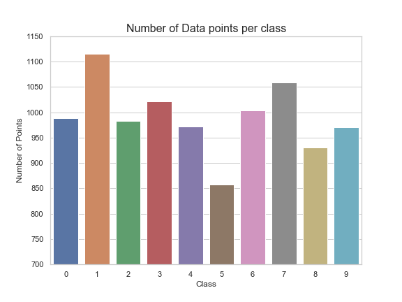

__Created on:__ 06/05/2020

__Last Updated:__ 07/05/2020

- Note pt1: I am aiming to finish this by Thursday evening. Meaning that the next project shall start (and hopefully finish) on Friday
- Note pt2: I'll probably take a look at random forests and gradient boosting trees next time, in order to really get familiar with all that (more so GBDT, and LightGBM). 

In this file, I'll be analysing the QMNIST Dataset and doing a brief introduction to CNN's with the help of Deep Learning Wizard (https://www.deeplearningwizard.com/deep_learning/practical_pytorch/pytorch_convolutional_neuralnetwork/). Notably, I would like to thank Ritche Ng for this fantastic resource to learn PyTorch (https://github.com/ritchieng/the-incredible-pytorch).

# What are Convolutional Neural Networks?
- Convolutional Neural Networks (CNNs) are a variant of traditional Neural Network Models with a primary assumption that a data point is primarily correlated to its neighbouring region, meaning that the layers aggregate relative regions, rather than taking parts from the whole of the previous layer.
- CNNs are an effective medium to use to analyse images. Famously, CNN's have been used to solve the problem specified by the MNIST dataset quite effectively. In particular, this task required the model to predict the number written on the hand-written digit, meaning that the nodes within each layer would be extracting features to determine which one of the ten digits the writing is. 
- CNN's can be quite effective, as notably, many datasets that have been analysed by CNNs may be split into multiple channels. Notably, a colour image may be split into red-blue-green channels, which are then used to solve their intended problem. 

# What dataset are we analysing?
In this project, I am analysing a variant of the MNIST dataset - the QMNIST dataset. The QMNIST dataset is a variant of the original MNIST dataset, where the exact preprocessing steps of the MNIST dataset have been lost, leaving uncertainty with what some of the numbers are actually intended to be, and how similar the images are to the original drawings. The details of this pre-processing wasn't too interesting to me at the time, so I decided to focus on writing the rest of the paper, but you can inspect the work done here: https://github.com/facebookresearch/qmnist. 

The QMNIST dataset consists of 60,000 training points and 60,000 test points. The first 10,000 points are shared with the original MNIST dataset. Within each point we have a 28 x 28 pixel image depicting a digit between 0 to 9. It turns out that the number of data points for each class differ. Here's a plot distinguishing the difference between the number of points in the test dataset:

Most studies associated with the MNIST dataset (or any of their variants) aim to correctly guess the digit written on the image. As a result, each digit is transformed into this 28 x 28 grid, and each point in the grid is estimated to go between 0 and 1 as how \`bright' the point is to the whole curve. I've provided an example of this point, as depicted by DeepLizard (https://www.youtube.com/watch?v=YRhxdVk_sIs).

- How an image is fed into the model?

Here are a sample of 20 images from the dataset:

# What does the model look like?
This model is obtained from https://github.com/yunjey/pytorch-tutorial/blob/master/tutorials/02-intermediate/convolutional_neural_network/main.py#L35-L56. Thank you for the efficient code! 

Regarding the details of the model, we have a 2 convoution layers followed by one fully-connected layer to map back to one of the ten classes. Each layer....

# What kind of results do we get? 
As expected, we get some really good looking results straight away from the training data, and great accuracy from model testing as well. I've attached an image of the log of the training and testing of the model below:

     
Even after the first epoch, we already get a model which is 98% accurate to the test data. So we find a quite straight-forward outcome. Of course this would be different if the dataset was more difficult. In addition, here's a confusion matrix to see where the errors in labelling were:

_Should I also perform validation? Probably, but that will depend on how much additional time I give myself to finish this project. If this paragraph has not been edited, then an additional validation step was not added._ 

# What project are we working on moving forward?
I'll probably take a look at Gradient Boosting Decision Trees and LightGBM again. I feel like I really need to revise those techniques. Later in the track, I do want to extend back into Recurrent Neural Networks (RNNs) and Graph Convolutional Networks (GCNs). 

# Appendix

## Template for putting images into md files:

