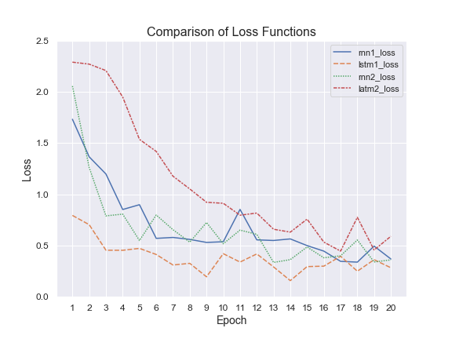
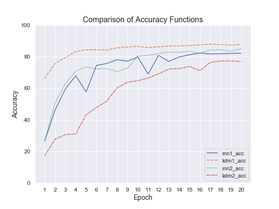
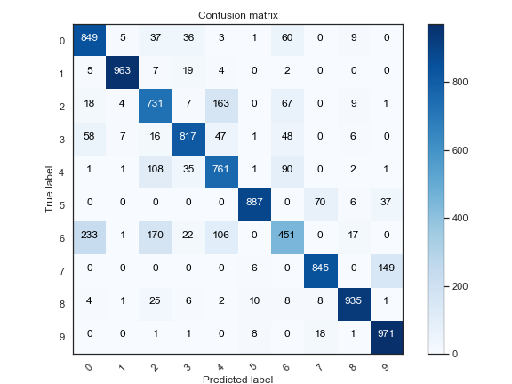
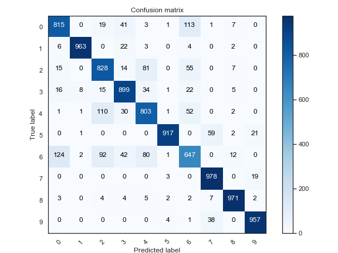
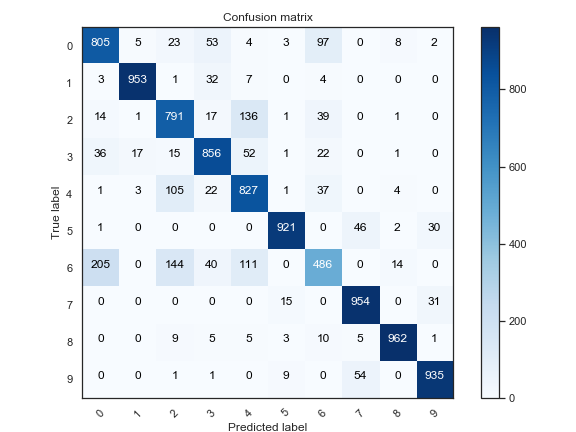
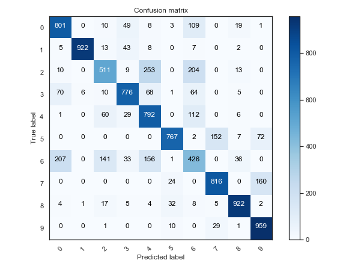

# Using RNNs to Predict the Class of Clothing in the Fashion-MNIST dataset
Created on: 10/05/2020 23:10

Updated on: 19/05/2020 13:06

# Introduction
Another important kind of Machine Learning model to explore in this series are Recurrent Neural Networks (RNNs). Recurrent Neural Networks build on 'Fully Connected networks' and implement the idea of 'hidden layers', where there is a process running in parallel which accounts for factors which would typically not be included using Fully Connected Networks (mainly just parts of the input that can be relevant to the overall output). 

# What is the Dataset?
The dataset being analysed is the Fashion-MNIST Dataset. Fashion-MNIST considers as an upgrade to MNIST to increase the difficulty of the classification problem. Fashion-MNIST is a collection of greyscale images of Fashion items, each labeled with one of ten classes:

| __Label__ | __Description__ |
|-----------|-----------------|
| 0         | T-shirt/top     |
| 1         | Trouser         |
| 2         | Pullover        |
| 3         | Dress           |
| 4         | Coat            |
| 5         | Sandal          |
| 6         | Shirt           |
| 7         | Sneaker         |
| 8         | Bag             |
| 9         | Ankle boot      |

Overall, Fashion-MNIST outlines a number of advantages over its predecessor, outlined here:

https://github.com/zalandoresearch/fashion-mnist

The fashion-MNIST dataset has a total of 60,000 points for training, 10,000 points for testing. 

# What method are we using?
Here, we are using RNN. Typically, the preferred method to analyse images are with Convolutional Neural Networks (CNNs) but we'll see how this goes. 

RNN's use a hidden layer to memorise parts of the input, allowing for more accurate predictions. This is especially helpful in applications involving text memorisation and sequence generation/prediction. What matters most in this project here is to understand the framework of building an RNN model (including the structures of a single layer in PyTorch.

In deeper models of RNNs, we encounter the issue of the earlier hidden layers having little impact on processing the latter layers, meaning that the model won't be able to identify deeply structured relationships (also known as the vanishing gradient problem). This is where LSTM's come into play. 

Long Short Term Memory networks (LSTMs), were originally developed in the late 90's by Hochreiter & Schmidhuber (1997), and are now widely used as the preferred form of RNNs. LSTM's have in-built methods to try to memorise the earlier layers of the model when computing the hidden layer, by using four separate layers which will eventually account for certain aspects of the previous set of layers. This is effectively described on the blog post: https://colah.github.io/posts/2015-08-Understanding-LSTMs/. Simplistically (and for the sake of learning this myself, I've copied the two diagrams distinguishing RNNs and LSTMs from that blog.   

One thing that I've learnt over doing this and the LSTM model is that multi-layer models are quite simple in PyTorch since you can just change the num_layers input.

# What are the results?
Initially, the RNN model was coded in a way which resulted in quite an ineffective model, with results essentially equal to random change. I wanted to use this opportunity to figure out why this was happening (since the CNN variant worked perfectly fine). 

## Part 1: Initial Modelling (with errors?)
So when trying to replicate the errors, the models turn out fine. Maybe it was something having to do with running the Anaconda session at the time?? This is a little frustrating, but it's good that the model works.

| __Epoch__ | __Iteration__ | __Loss__ | __Accuracy (%)__ |
|-----------|---------------|----------|------------------|
| 1         | 500           | 2.31     | 8.00             |
| 2         | 1000          | 2.31     | 8.00             |
| 3         | 1500          | 2.31     | 8.00             |
| 4         | 2000          | 2.31     | 8.00             |
| 5         | 2500          | 2.30     | 8.00             |

Never mind! I think I figured it out. When I was constantly running the model. I never included the criterion and optimizer back into the model, resulting in a model that wasn't learning properly. 

| __Epoch__ | __Iteration__ | __Loss__ | __Accuracy (%)__ |
|-----------|---------------|----------|------------------|
| 1         | 500           | 2.31     | 9.78             |
| 2         | 1000          | 2.30     | 9.78             |
| 3         | 1500          | 2.31     | 9.78             |
| 4         | 2000          | 2.32     | 9.78             |
| 5         | 2500          | 2.30     | 9.78             |

So if I run the model again, but with the criterion and optimizer, then I should get good results. 

| __Epoch__ | __Iteration__ | __Loss__ | __Accuracy (%)__ |
|-----------|---------------|----------|------------------|
| 1         | 500           | 2.18     | 23.18            |
| 2         | 1000          | 1.46     | 35.68            |
| 3         | 1500          | 1.19     | 50.91            |
| 4         | 2000          | 1.03     | 61.85            |
| 5         | 2500          | 1.15     | 62.14            |
| 6         | 3000          | 0.86     | 67.52            |

Fantastic! Let's run some more models, compare them (so see where the models peak, and maybe some plots too). 

## Part 2: Progression of one model per epoch

| __Epoch__ | __Iteration__ | __Loss__ | __Accuracy__ |
|-----------|---------------|----------|--------------|
| 1         | 600           | 1.73     | 26.54%       |
| 2         | 1200          | 1.37     | 46.11%       |
| 3         | 1800          | 1.20     | 59.55%       |
| 4         | 2400          | 0.85     | 67.90%       |
| _5_         | _3000_          | _0.90_     | _57.59%_      |
| 6         | 3600          | 0.57     | 74.43%       |
| 7         | 4200          | 0.58     | 75.63%       |
| 8         | 4800          | 0.56     | 78.09%       |
| 9         | 5400          | 0.53     | 77.10%       |
| 10        | 6000          | 0.54     | 79.80%       |
| _11_        | _6600_          | _0.85_     | _68.99%_       |
| 12        | 7200          | 0.55     | 80.80%       |
| 13        | 7800          | 0.55     | 76.96%       |
| 14        | 8400          | 0.56     | 79.78%       |
| 15        | 9000          | 0.50     | 81.20%       |
| 16        | 9600          | 0.44     | 82.32%       |
| 17        | 10200         | 0.34     | 81.70%       |
| 18        | 10800         | 0.34     | 81.86%       |
| _19_        | _11400_         | _0.49_     | _82.08%_       |
| 20        | 12000         | 0.37     | 82.10%       |

From the looks of it, there is a fairly steady increase in accuracy after each epoch. In addition, I notice that after some epochs, there is an increase in the loss function, which are followed by greater decreases in the following epochs. This looks like the model going through different local minima in the gradient descent search. These points are italicised on the table. 

Overall, after 20 epochs (and over the long term), we achieve approximately 82% accuracy. Not bad!

## Part 3: Comparison of the Four models

### Overall Comparison of the Models

     
     
| __Model__      | __Peak Epoch__ | __Loss__ | __Accuracy__ | __Time Taken__ |
|----------------|----------------|----------|--------------|----------------|
| RNN (1-layer)  | 16             | 0.44     | 82.32%       | 577.76         |
| LSTM (1-layer) | 17             | 0.39     | 87.87%       | 1192.22        |
| RNN (2-layer)  | 20             | 0.36     | 84.90%       | 872.03         |
| LSTM (2-layer) | 18             | 0.77     | 77.30%       | 2628.22        |

Accuracy-wise, we have (from best to worst), Single layer LSTM (LSTM-1), Two layer RNN (RNN-2), Single Layer RNN (RNN-1), and Two layer LSTM (LSTM-2). In this case, it appears that LSTM has a sufficient amount of complexity for accurate predictions, while LSTM-2 made it too complex. Also notice that the RNN models went the other way around, with RNN-2 working better than RNN-1 after 20 epochs. 

One other thing to point out is that the LSTM models took much longer to train than the RNN models. So we had increasing accuracy from RNN-1, to RNN-2, to LSTM-1, noticing that there is an increase in processing time for increasing complexity (which may not be so beneficial, if we look at the outcome of LSTM-2). 

### RNN-1 Layer Model

### LSTM-1 Layer Model

### RNN-2 Layer Model

### LSTM-2 Layer Model

# What do we want to do moving forward?
There are still a lot of stuff for me to work on this week, a lot of it primarily involves reviewing the crime and New York location datasets. In particular, it will be worthwhile reviewing the theory associated with the models that I used to analyse that dataset at the time (Random Forests, SVR etc). It will also be extremely worthwhile to review the dataset and change it to a classification problem. 

In terms of describing the actual function of each model, I personally feel like I'd like to have more detail in why and how these models work, but this will only come when I personally get a better understanding of how they work. In future projects, I'd like to be slowly adding more detail to the model. I'm sure there will be mistakes along the way, but they will be corrected as the mistakes are identified. 

# Appendix

## Resources used:
http://www.wildml.com/2015/09/recurrent-neural-networks-tutorial-part-1-introduction-to-rnns/

https://colah.github.io/posts/2015-08-Understanding-LSTMs/

http://karpathy.github.io/2015/05/21/rnn-effectiveness/

## To-do list
- Describe results
   - Initial Modelling
   - Progression of One Model Per Epoch
   - Comparison of four models
   - Comparison of confusion matrices 

## Template for images

