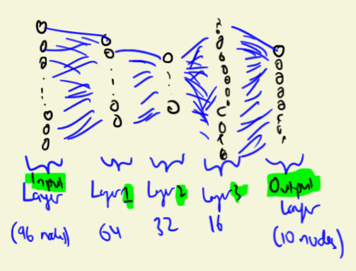
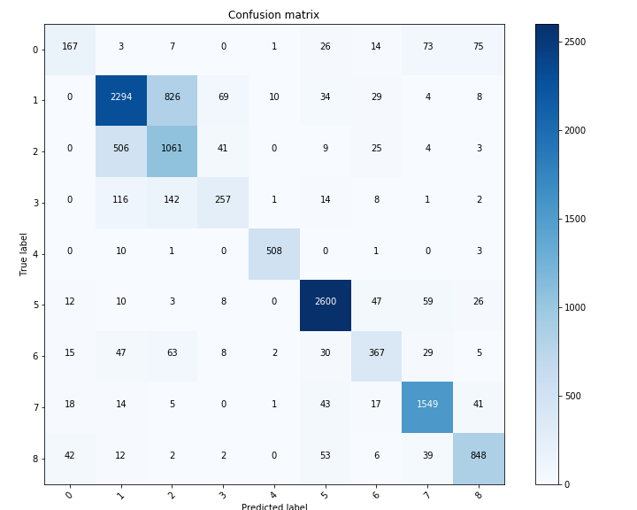
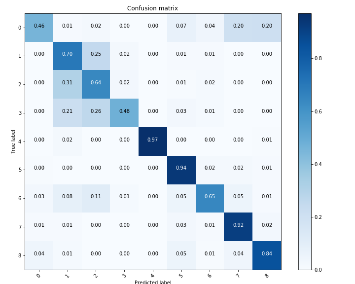

# Otto Dataset Analysis

__Created on:__ 19/04/2020

__Last Updated:__ 19/04/2020

In this file, I'll be analysing the Otto data and providing the relevant scripts and data (at the very least the hyperlink of the dataset)

## 1. Summary of the data
By viewing the dataset, you observe that there are a total of 61,878 products. Each product has 93 numerical features, representing counts of different events. In addition, each product is separated by 9 different classes, listed from Class 1 to Class 9. The objective of this project is to predict the class of each of the products (in my case via basic neural networks), with the objective to understand how a Dataset and DataLoader works in PyTorch. That way, I can move on and use other data and apply more complex models.

Upon observing the points in the data, we notice that it is pretty sparse (density = 20.66%). 

Here's a sample of the dataset:
__Table 1:__ *Sample of the dataset* 
| id | feat_1 | feat_2 | feat_3 | feat_4 | feat_5 | feat_6 | feat_7 | feat_8 | feat_9 | feat_10 | ... | feat_85 | feat_86 | feat_87 | feat_88 | feat_89 | feat_90 | feat_91 | feat_92 | feat_93 | target |
|-------|--------|--------|--------|--------|--------|--------|--------|--------|--------|---------|-----|---------|---------|---------|---------|---------|---------|---------|---------|---------|---------|
| 61874 | 1 | 0 | 0 | 1 | 1 | 0 | 0 | 0 | 0 | 0 | ... | 1 | 0 | 0 | 0 | 0 | 0 | 0 | 2 | 0 | Class_9 |
| 61875 | 4 | 0 | 0 | 0 | 0 | 0 | 0 | 0 | 0 | 0 | ... | 0 | 2 | 0 | 0 | 2 | 0 | 0 | 1 | 0 | Class_9 |
| 61876 | 0 | 0 | 0 | 0 | 0 | 0 | 0 | 3 | 1 | 0 | ... | 0 | 3 | 1 | 0 | 0 | 0 | 0 | 0 | 0 | Class_9 |
| 61877 | 1 | 0 | 0 | 0 | 0 | 0 | 0 | 0 | 0 | 0 | ... | 0 | 0 | 0 | 0 | 1 | 0 | 3 | 10 | 0 | Class_9 |
| 61878 | 0 | 0 | 0 | 0 | 0 | 0 | 0 | 0 | 0 | 0 | ... | 0 | 0 | 0 | 0 | 0 | 0 | 0 | 2 | 0 | Class_9 |

You can view the dataset on this link: https://www.kaggle.com/c/otto-group-product-classification-challenge/data

Here are the distribution in classes:

__Insert histogram of classes__

If you observe any of the features, you get quite similar-looking histograms:

__Insert histogram here__
## 2. Structure of the Model (and Hyperparameters)

## 3. Analysis of the results

     
     

     
## 4. The next step
Thanks for following this post, I'll be looking for at other datasets in the future.
