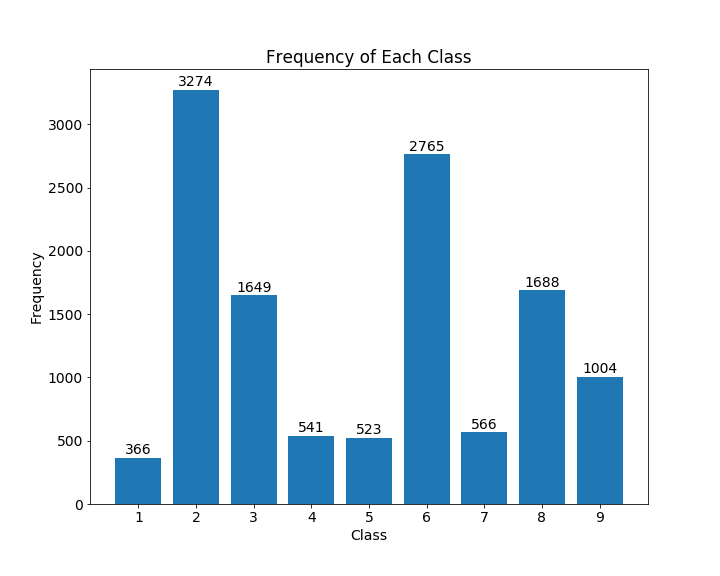
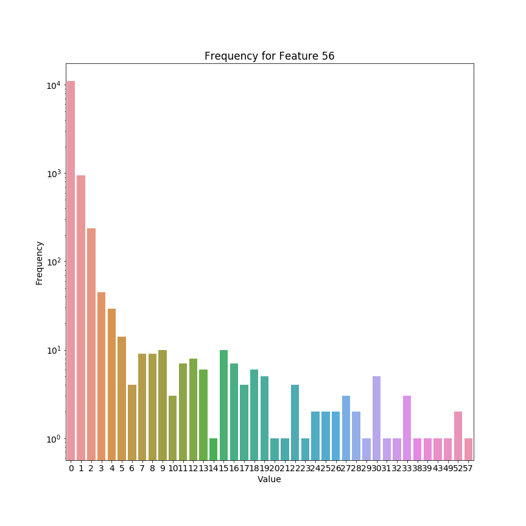
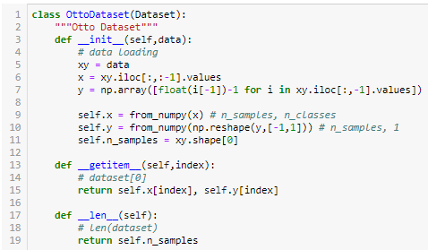
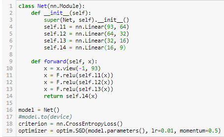

# Otto Dataset Analysis

__Created on:__ 19/04/2020

__Last Updated:__ 24/04/2020

In this file, I'll be analysing the Otto data and providing the relevant scripts and data (at the very least the hyperlink of the dataset)

## 1. Summary of the data
By viewing the dataset, you observe that there are a total of 61,878 products. Each product has 93 numerical features, representing counts of different events. In addition, each product is separated by 9 different classes, listed from Class 1 to Class 9. The objective of this project is to predict the class of each of the products (in my case via basic neural networks), with the objective to understand how a Dataset and DataLoader works in PyTorch. That way, I can move on and use other data and apply more complex models.

Upon observing the points in the data, we notice that it is pretty sparse (density = 20.66%). 

Here's a sample of the dataset:

__Table 1:__ *Sample of the dataset* 

id | feat_1 | feat_2 | feat_3 | feat_4 | feat_5 | ... | feat_89 | feat_90 | feat_91 | feat_92 | feat_93 | target 
|---------|-----|---------|---------|---------|-----|----|---------|---------|---------|---------|---------|---------|
61874 | 1 | 0 | 0 | 1 | 1 | ... | 0 | 0 | 0 | 2 | 0 | Class_9 
61875 | 4 | 0 | 0 | 0 | 0 | ... | 2 | 0 | 0 | 1 | 0 | Class_9 
61876 | 0 | 0 | 0 | 0 | 0 | ... | 0 | 0 | 0 | 0 | 0 | Class_9 
61877 | 1 | 0 | 0 | 0 | 0 | ... | 1 | 0 | 3 | 10 | 0 | Class_9 
61878 | 0 | 0 | 0 | 0 | 0 | ... | 0 | 0 | 0 | 2 | 0 | Class_9 

You can view the dataset on this link: 

https://www.kaggle.com/c/otto-group-product-classification-challenge/data

Here are the distribution in classes:

If you observe any of the features, you get quite similar-looking histograms:

     
Looking at the plot above, we notice that there is clearly a disproportionate number of items per class. Classes 2 and 6 have the greatest numbers, while classes 1, 4, 5 and 7 have the fewest.

We then used the Dataset class in PyTorch to allow the data to load into the model.

     
## 2. Structure of the Model (and Hyperparameters)

     
__Figure xx:__ *A diagram of the kind of model employed to get the results*
In this model, we employ a 4-linear layer model which utilises ReLU after each layer. The output layer provides a probability that the input belongs to one of the nine classes. Then, the results are compared to the true labels via a cross-entropy function. 

     
During backpropagation, the parameters are optimised by stochastic gradient descent (SGD).

## 3. Analysis of the results

Because we decided to run the experiments through PyTorch, all the classes had to be pushed back by one, meaning that Class '0' is actually Class '1', Class '1' is Class '2', and so on.

          

In general, we had about half of the classes showing a high ratio of true positives (Classes 5,6,8, and 9 had 97%, 94%, 92%, and 84% accuracies respectively). 

Observing the results from our confusion matrices, notice that there is some clear overlap between mixing up classes 2 and 3, with 25% and 31% of Class 2 and 3 objects being predicted as each other respectively. In addtion, there were also (relatively) low accuracies observed for Classes 1, 4 and 7 (46%, 48% and 65% respectively). 

## 4. The next step
Here are some things that I would've like to do in the future:
   - Write a better report
   - Create experiments and changing the number of layers or the size of each layer
   - Make the number of samples per class proportionate and run experiments through that
   - Since the data was randomly generated, I think running multiple experiments would have been extremely beneficial for this project. 

Thanks for following this post, I'll be looking for at other datasets in the future.

[__Back to the main page__](https://phillipluong.github.io/PyTorchProjects101/)
